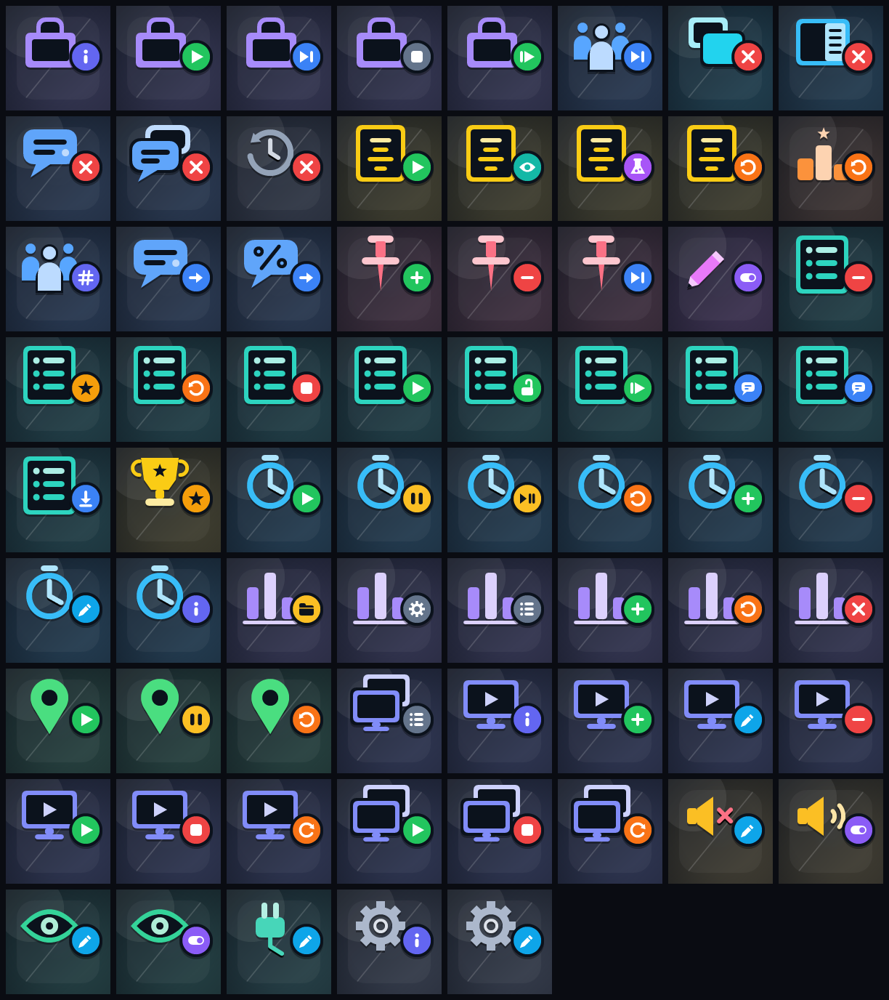

# Social Stream Ninja Stream Deck Plugin

[](#status)
[](#requirements)
[](https://docs.elgato.com/streamdeck/sdk/)
[](#requirements)
[](https://socialstream.ninja/)

Native Elgato Stream Deck plugin for Social Stream Ninja.

Social Stream Ninja collects live chat and stream events from multiple platforms into browser overlays, docks, queues, polls, waitlists, and its desktop app. This plugin lets Stream Deck users trigger those controls from keys through either the desktop app or Chrome extension.

The plugin uses the official Stream Deck SDK, TypeScript source, generated icon assets, a guided property inspector, centralized command payload builders, and focused unit tests.

## Preview


Preset key icons, in command registry order:



## Status

Current workspace capabilities:

- Guided setup in the property inspector with a short Social Stream Ninja explanation.
- Setup action for entering the session ID and testing the plugin connection.
- Preset Command action with Social Stream Ninja remote controls and capability-aware desktop app source controls.
- A distinct key icon for every preset: a family glyph (queue, credits, timer, poll, waitlist, source, ...) plus a play/stop/next/reset/clear style badge, generated from the command registry.
- Custom Command action.
- Global session, password, and transport configuration in the property inspector.
- P2P by default through the same VDO.Ninja data-channel transport used by Social Stream docks and overlays.
- Optional WebSocket client for `wss://io.socialstream.ninja`, with automatic HTTP capability and command fallback when the hosted socket opens but does not relay responses.
- Automatic reconnect and capability refresh after network loss, system wake, or a Social Stream Ninja restart.
- HTTP fallback supports capability discovery, desktop-app controls, primitive values, and URL-encoded structured values.
- Self-contained plugin bundles that do not depend on the development `node_modules` folder.
- A command registry seeded with common Social Stream Ninja commands from `../api.md`, including credits, dock pinning, waitlist, chat, poll, queue, and desktop app source presets.
- Capability-aware desktop app source controls when Social Stream Ninja advertises support.
- Stream Deck + timer dial with live time/status feedback.
- Query presets briefly show returned queue size, timer time, poll/source counts, or source status on the key when available.
- Stream Deck + chat review strip that listens only while visible, browses recent chat from the selected transport, pins messages, and features pinned chat.
- Ready-to-edit starter profiles for Stream Deck and Stream Deck + that never replace the active profile.
- Copyable diagnostics with plugin/runtime versions and a sanitized last error; session IDs are excluded.
- Per-command capability filtering with the detected desktop app and bridge version shown in setup.

## Suggested Actions

| Action | Purpose | Starting commands |
| --- | --- | --- |
| Setup | Enter the session ID, optional password, and connection mode | P2P by default; optional WebSocket send channel 1, listen channel 2 |
| Preset Command | Button presets for common remote controls and advertised desktop app source controls | `creditsStart`, `creditsPreview`, `creditsTest`, `creditsReset`, `clearOverlay`, `clearDock`, `nextInQueue`, `resetwaitlist`, `startSource`, `stopSource` |
| Custom Command | Send any `{ action, target, value }` payload | Power-user and development testing |
| Timer Dial | Stream Deck + timer display and control | Turn to adjust, press to start/pause, hold touch to reset |
| Chat Review | Stream Deck + recent chat display and pin workflow | Turn to browse, press to pin, tap to feature, hold to unpin |

## API Assumptions

Based on `../api.md` and Social Stream's existing VDO.Ninja transport:

- P2P signaling host: `wss://wss.socialstream.ninja`
- P2P room and viewed stream ID: the Social Stream session ID
- WebSocket host: `wss://io.socialstream.ninja`
- HTTP host: `https://io.socialstream.ninja`
- Remote-control send channel: channel 1 by default
- Remote-control callback/capability listen channel: channel 2 by default
- WebSocket chat-listener channel: channel 4, if the user enables chat message relay
- Simple command shape: `{ "action": "clearOverlay" }`
- Value command shape: `{ "action": "sendChat", "value": "Hello" }`
- Targeted chat keys save the stable desktop app source ID, then resolve its current source type and tab ID when pressed. Source URLs are never returned to the plugin.
- Desktop app controls use the same Social Stream Ninja API socket; the plugin does not connect to the desktop app directly.

## Requirements

- Stream Deck desktop app 6.9 or newer.
- Node.js 20+ for local development.
- Social Stream Ninja session ID. The hosted Remote Control API only needs to be enabled when WebSocket mode is selected.

Desktop app users can open **Stream Deck Setup**, or choose **File → Set Up Stream Deck**, to copy the active session ID. Chrome extension users can copy their unique session ID from **Settings**. The same concise guide is available at `https://socialstream.ninja/streamdeck/`.

## Development

```bash
cd plugin
npm install
npm test
npm run check
npm run build
npm run build:release # includes Windows and macOS P2P native runtimes
npx @elgato/cli@latest validate ninja.socialstream.streamdeck.sdPlugin --no-update-check
```

Optional hosted P2P integration tests (require internet access):

```bash
npm run test:p2p:live         # connection failures, reconnects, TURN, passwords, bursts, and transport switching
npm run test:p2p:runtime-live # built plugin process, commands, chat, and signaling recovery
```

Generated Stream Deck bundle:

```text
plugin/ninja.socialstream.streamdeck.sdPlugin/
```

Link locally:

```bash
cd plugin
npm run build
npx @elgato/cli@latest link ninja.socialstream.streamdeck.sdPlugin
npx @elgato/cli@latest restart ninja.socialstream.streamdeck
```

## Releases

GitHub Actions tests and validates the plugin on Windows, macOS, and Linux before publishing the installable `.streamDeckPlugin` file from `main`. Each release gets a unique build version, such as `v0.2.1.12`, and the workflow can also be run manually.

## Device Notes

- Key actions work on Stream Deck models with keys.
- Timer Dial and Chat Review appear only for Stream Deck + encoders.
- In P2P mode, Chat Review receives the normal Social Stream feed directly. In WebSocket mode it requires **Send chat messages to API server** in Social Stream Ninja.

## License

Licensed under the [GNU General Public License v3.0](LICENSE).


### Product buttons

Add four **Preset Command** keys and choose **Products & support**: Show product, Next product, Hide products, Resume products. Show accepts a saved product URL (leave blank for the current/first product). Next and Hide accept seconds; 0 lasts until changed. These use the existing connection and wait for SSN's result. Save and enable products in SSN first. Hide affects promotions only; purchase alerts continue. Public-page publishing stays in SSN's setup panel. Older hosts without these capabilities need updating. [Guide](../docs/product-controls.html).


Show Product now offers a saved-product picker in the inspector. Refresh products and state reads the current catalog from SSN; a missing selection is retained for review. The optional Product State preset refreshes its selected/hidden/scheduled display every five seconds while visible, using one shared poll for visible state keys. This reports SSN selection, not OBS live/scene visibility. Local control acknowledgements do not wait for public-shop publishing. An OBS control dock can reuse the same `getCommerceState` and commerce-control API without putting controls on the audience overlay.
