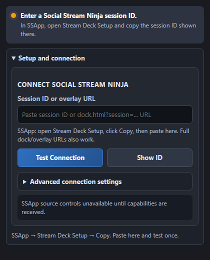

# Social Stream Ninja Stream Deck Plugin

[](#status)
[](#requirements)
[](https://docs.elgato.com/streamdeck/sdk/)
[](#requirements)
[](https://socialstream.ninja/)

Native Elgato Stream Deck plugin for Social Stream Ninja.

Social Stream Ninja collects live chat and stream events from multiple platforms into browser overlays, docks, queues, polls, waitlists, and its desktop app. This plugin lets Stream Deck users trigger those controls from keys through either the desktop app or Chrome extension.

The plugin uses the official Stream Deck SDK, TypeScript source, generated icon assets, a guided property inspector, centralized command payload builders, and focused unit tests.

## Preview



## Status

Current workspace capabilities:

- Guided setup in the property inspector with a short Social Stream Ninja explanation.
- Setup action for entering the session ID and testing the plugin connection.
- Preset Command action with Social Stream Ninja remote controls and capability-aware desktop app source controls.
- Custom Command action.
- Global session/API configuration in the property inspector.
- WebSocket client for `wss://io.socialstream.ninja`.
- Automatic WebSocket reconnect and capability refresh when Social Stream Ninja restarts.
- Optional HTTP fallback for simple request/response commands.
- Self-contained plugin bundles that do not depend on the development `node_modules` folder.
- A command registry seeded with common Social Stream Ninja commands from `../api.md`, including dock pinning, waitlist, chat, poll, queue, and desktop app source presets.
- Capability-aware desktop app source controls when Social Stream Ninja advertises support.
- Stream Deck + timer dial with live time/status feedback.
- Stream Deck + chat review strip that listens only while visible, browses recent channel-4 chat, pins messages, and features pinned chat.
- Per-command capability filtering with the detected desktop app and bridge version shown in setup.

## Suggested Actions

| Action | Purpose | Starting commands |
| --- | --- | --- |
| Setup | Enter the session ID and test the plugin connection | WebSocket send channel 1, listen channel 2 |
| Preset Command | Button presets for common remote controls and advertised desktop app source controls | `clearOverlay`, `clearDock`, `clearHistory`, `nextInQueue`, `resetleaderboard`, `pin`, `unpin`, `nextPinned`, `resetwaitlist`, `startentries`, `downloadwaitlist`, `selectwinner`, `startSource`, `stopSource` |
| Custom Command | Send any `{ action, target, value }` payload | Power-user and development testing |
| Timer Dial | Stream Deck + timer display and control | Turn to adjust, press to start/pause, hold touch to reset |
| Chat Review | Stream Deck + recent chat display and pin workflow | Turn to browse, press to pin, tap to feature, hold to unpin |

## API Assumptions

Based on `../api.md`:

- WebSocket host: `wss://io.socialstream.ninja`
- HTTP host: `https://io.socialstream.ninja`
- Remote-control send channel: channel 1 by default
- Remote-control callback/capability listen channel: channel 2 by default
- Chat-listener channel: channel 4, if the user enables chat message relay
- Simple command shape: `{ "action": "clearOverlay" }`
- Value command shape: `{ "action": "sendChat", "value": "Hello" }`
- Targeted chat keys save the stable desktop app source ID, then resolve its current source type and tab ID when pressed. Source URLs are never returned to the plugin.
- Desktop app controls use the same Social Stream Ninja API socket; the plugin does not connect to the desktop app directly.

## Requirements

- Stream Deck desktop app 6.8 or newer.
- Node.js 20+ for local development.
- Social Stream Ninja session ID with remote API control enabled.

Desktop app users can open **Stream Deck Setup**, or choose **File → Set Up Stream Deck**, to copy the active session ID. Chrome extension users can copy their unique session ID from **Settings**. The same concise guide is available at `https://socialstream.ninja/streamdeck/`.

## Development

```bash
cd plugin
npm install
npm test
npm run check
npm run build
npx @elgato/cli@latest validate ninja.socialstream.streamdeck.sdPlugin --no-update-check
```

Generated Stream Deck bundle:

```text
plugin/ninja.socialstream.streamdeck.sdPlugin/
```

Link locally:

```bash
cd plugin
npm run build
npx @elgato/cli@latest link ninja.socialstream.streamdeck.sdPlugin
npx @elgato/cli@latest restart ninja.socialstream.streamdeck
```

## Releases

GitHub Actions builds and publishes the installable `.streamDeckPlugin` file after every commit to `main`. Each release gets a unique build version, such as `v0.2.1.12`, and the workflow can also be run manually.

## Device Notes

- Key actions work on Stream Deck models with keys.
- Timer Dial and Chat Review appear only for Stream Deck + encoders.
- Chat Review requires **Send chat messages to API server** in Social Stream Ninja. No external link is needed during setup.
