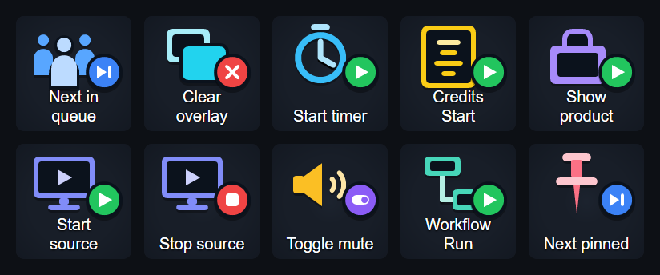
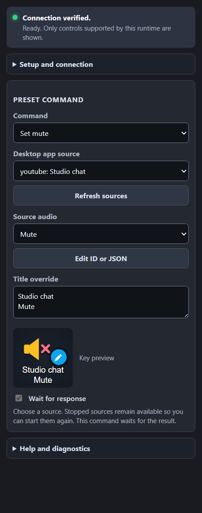

# Social Stream Ninja for Stream Deck

Control chat, overlays, queues, timers, products, and desktop app sources from your Stream Deck.

[Download the plugin](https://github.com/steveseguin/ssn-streamdeck/releases/latest) · [Watch the 2-minute overview](https://cdn.jsdelivr.net/gh/steveseguin/ssn-streamdeck@media/ssn-streamdeck.mp4) · [Setup guide](https://socialstream.ninja/streamdeck/) · [All controls](https://socialstream.ninja/streamdeck/guide.html)



## Get started

Requires Stream Deck 6.9 or newer on Windows 10+ or macOS 12+, and the Social Stream Ninja desktop app or Chrome extension.

1. Download and open the **`.streamDeckPlugin`** file from the latest release.
2. Keep Social Stream Ninja running. Copy your session ID from **Stream Deck Setup** in the desktop app, or **Settings** in the extension.
3. Drag **Setup** onto a key. Open **Setup and connection** and paste your session ID or full overlay URL. Leave the connection mode on **Peer-to-peer**.
4. Choose **Test Connection**. The Setup key shows **Online** when connected.
5. Add a **Preset Command** key and choose a command. Keep its destination open, such as your dock for queue controls or the Credits page for credits.

Connection settings apply to all Social Stream Ninja actions and profiles. Keep your session ID and password private. Editable starter profiles are included; select one in Stream Deck to try it.

## Choose your controls

| Action | Use it to |
| --- | --- |
| **Setup** | Configure the shared connection and check its status. |
| **Preset Command** | Choose a command, fill in any required settings, and preview its key title. |
| **Custom Command** | Send a custom API command for an advanced workflow. |
| **Timer Dial** | Turn to adjust the timer; press to start or pause. Requires Stream Deck +. |
| **Chat Review** | Turn to browse chat; press to pin; tap the touchscreen to feature the next pinned message. Requires Stream Deck +. |

For desktop source controls, choose a source by name. Stopped sources stay in the list so you can start them again. **Set mute** offers Mute / Unmute; **Set visibility** offers Show / Hide. Visibility controls the source window in the desktop app.



Use **Refresh sources** after changing sources in the desktop app. If a saved source is unavailable, its value stays saved until you choose another. **Edit ID or JSON** opens the advanced value field.

## More ways to use it

- **Timer shortcuts:** hold the dial while turning for larger steps. Hold the touchscreen above it to reset.
- **Event Flow:** save and enable a flow with a **Run from Stream Deck / API** trigger. Choose **Run workflow**, refresh workflows, and select it. [Workflow guide](https://socialstream.ninja/beta/docs/streamdeck-event-flow.html).
- **Products:** save and enable products in Social Stream Ninja, then use Show product, Next product, Hide products, or Resume products. Product state shows the selected, hidden, or scheduled state in SSN; it does not indicate OBS scene visibility. [Product guide](https://socialstream.ninja/docs/product-controls.html).
- **WebSocket mode:** enable the matching remote API control in Social Stream Ninja before selecting WebSocket in the plugin. For Chat Review, also enable **Send chat messages to API server**. The default connection needs no channel changes.

## Need help?

Open **Help and diagnostics** on the selected action. If a command is unavailable, update both Social Stream Ninja and the plugin, then test the connection again. See the [controls and troubleshooting guide](https://socialstream.ninja/streamdeck/guide.html), or [report a problem](https://github.com/steveseguin/ssn-streamdeck/issues) with the command and its error. Do not include private session IDs or passwords.

## Build from source

Requires Node.js 20.5.1 or newer.

```sh
cd plugin
npm install
npm run check
npm run build
```

The bundle is written to `plugin/ninja.socialstream.streamdeck.sdPlugin/`. Use `npm run build:release` to include both Windows and macOS P2P runtimes. See the [remote-control API reference](docs/remote-control-api.md) for command details.

Licensed under [GPL-3.0](LICENSE).
